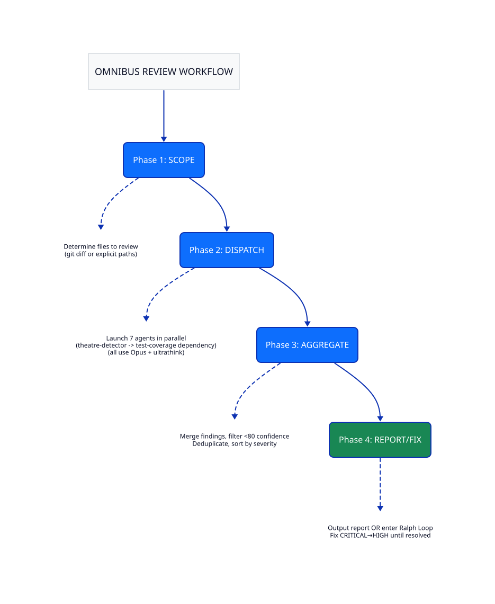

# Omnibus Review Maxxing

A comprehensive Claude Code review plugin combining 6 specialized agents with Ralph Loop iterative fixing.

## Features

- **6 Specialized Review Agents** - Each focused on a specific domain
- **Opus + Ultrathink** - Maximum reasoning depth for all reviews
- **JSON Output** - Structured, aggregatable findings
- **Ralph Loop Integration** - Iterative fixing until issues resolved
- **Rich HTML Documentation** - Visual workflows, severity guides, CWE references

## Quick Start

```bash
# Basic review (report only)
/omnibus-review

# Review specific files
/omnibus-review src/api/ src/models/

# Generate interactive HTML report
/omnibus-review --html

# Review with iterative fixing (max 4 iterations)
/omnibus-review --fix

# Use Opus for fixing (default: Sonnet)
/omnibus-review --fix --opus
```

## The 8 Agents

### Review Agents (6)

| Agent | Focus | Color |
|-------|-------|-------|
| **correctness-auditor** | Bugs, logic errors, null handling, race conditions | 🔴 Red |
| **security-sentinel** | OWASP vulnerabilities, injection, auth flaws | 🔴 Red |
| **claude-md-compliance** | CLAUDE.md guideline violations | 🟡 Yellow |
| **test-coverage-analyzer** | Test gaps, missing edge cases, weak assertions | 🟢 Green |
| **silent-failure-hunter** | Empty catches, swallowed errors, missing logging | 🟡 Yellow |
| **code-quality-reviewer** | Duplication, complexity, naming, patterns | 🔵 Blue |

### Fix Agents (2)

| Agent | Focus | Color |
|-------|-------|-------|
| **omnibus-fixer** | Applies COMPLETE fixes per file, updates fix plans | 🟣 Purple |
| **omnibus-validator** | Validates fixes match plan, catches shortcuts | 🟢 Green |

## Workflow



## Severity Levels

| Severity | Color | Threshold | Action |
|----------|-------|-----------|--------|
| **CRITICAL** | 🔴 `#dc3545` | Confidence ≥80 | Must fix before merge |
| **HIGH** | 🟠 `#fd7e14` | Confidence ≥80 | Should fix before merge |
| **MEDIUM** | 🟡 `#ffc107` | Confidence ≥80 | Consider fixing |
| **LOW** | 🔵 `#0d6efd` | Confidence ≥80 | Nice to have |

## Fix Mode Architecture

When `--fix` is enabled, the review uses a parallel subagent architecture for context isolation:

```
Review (6 agents) → Aggregate → Group by file →
    ┌─ omnibus-fixer (file A) ─┐
    ├─ omnibus-fixer (file B) ─┼→ Updated fix plans
    └─ omnibus-fixer (file C) ─┘
              ↓
    ┌─ omnibus-validator (file A) ─┐
    ├─ omnibus-validator (file B) ─┼→ Validation reports  
    └─ omnibus-validator (file C) ─┘
              ↓
    Re-review → Loop if CRITICAL/HIGH remain
```

### Key Principles

- **No confirmation prompts** - `--fix` proceeds automatically
- **Complete fixes only** - No shortcuts, address root cause
- **Architecture alignment** - Fixes must fit existing patterns
- **Divergence tracking** - Deviations require documented reasons
- **Context isolation** - Each subagent starts fresh (no compaction)

### Iteration Loop

1. Run comprehensive review (6 agents)
2. Generate fix plans per file
3. Dispatch parallel fixer subagents (one per file)
4. Dispatch parallel validator subagents (verify fixes)
5. Re-run review on modified files
6. Repeat until no CRITICAL/HIGH issues remain OR max iterations (default: 4)

**Early Exit Phrase:** `QUANTUM_EIGENSTATE_CRYSTALLIZED_OMEGA`

See [docs/omnibus-workflow.svg](docs/omnibus-workflow.svg) for the complete visual workflow.

## Installation

### Option 1: Clone directly
```bash
git clone git@github.com:andrewcchoi/omnibus-review-maxxing.git ~/.claude/plugins/omnibus-review-maxxing
```

### Option 2: Add to settings
Add to your `.claude/settings.json`:
```json
{
  "plugins": ["https://github.com/andrewcchoi/omnibus-review-maxxing"]
}
```

## Documentation

Rich HTML documentation is included in the plugin:

| Document | Description |
|----------|-------------|
| [README.html](README.html) | Main documentation with architecture diagram |
| [docs/workflow-diagram.html](docs/workflow-diagram.html) | Visual 4-phase workflow |
| [docs/severity-guide.html](docs/severity-guide.html) | Color-coded severity classification |
| [docs/agent-overview.html](docs/agent-overview.html) | 6 agents with responsibilities |
| [docs/output-templates.html](docs/output-templates.html) | Output format examples |
| [references/checklist.html](references/checklist.html) | Pre/post review checklists |
| [references/cwe-quick-ref.html](references/cwe-quick-ref.html) | Security CWE reference |

## Commands

| Command | Description |
|---------|-------------|
| `/omnibus-review` | Run comprehensive review |
| `/cancel-omnibus` | Cancel active review loop |

## Arguments

| Argument | Description | Default |
|----------|-------------|---------|
| `--fix` | Enable Ralph Loop iterative fixing | Off |
| `--html` | Generate interactive HTML report with risk maps | Off |
| `--max-iterations N` | Maximum fix iterations | 4 |
| `--opus` | Use Opus for fixing (review always uses Opus) | Sonnet |
| `[files...]` | Specific files/directories to review | git diff |

## HTML Output

With `--html`, the review generates a self-contained HTML report at `.omnibus-review/report_[timestamp].html`:

- **Risk map** - Clickable severity chips for quick navigation to files
- **File cards** - Each file with its findings grouped
- **Severity indicators** - Color-blind accessible (icons + colors)
- **Comment bubbles** - Findings with severity, description, location
- **Next steps** - Actionable checklist

Open the HTML file in any browser. No build step or dependencies required.

## Output Format

All agents output structured JSON:

```json
{
  "agent": "security-sentinel",
  "findings": [
    {
      "severity": "CRITICAL",
      "confidence": 95,
      "location": { "file": "src/api.py", "line_start": 42 },
      "title": "SQL Injection vulnerability",
      "description": "User input directly concatenated into SQL query",
      "fix": { "suggestion": "Use parameterized queries" }
    }
  ],
  "summary": { "critical": 1, "high": 0, "medium": 2, "low": 1 }
}
```

## License

MIT License - see [LICENSE](LICENSE) for details.

## Credits

Built with Claude Code using subagent-driven development.
